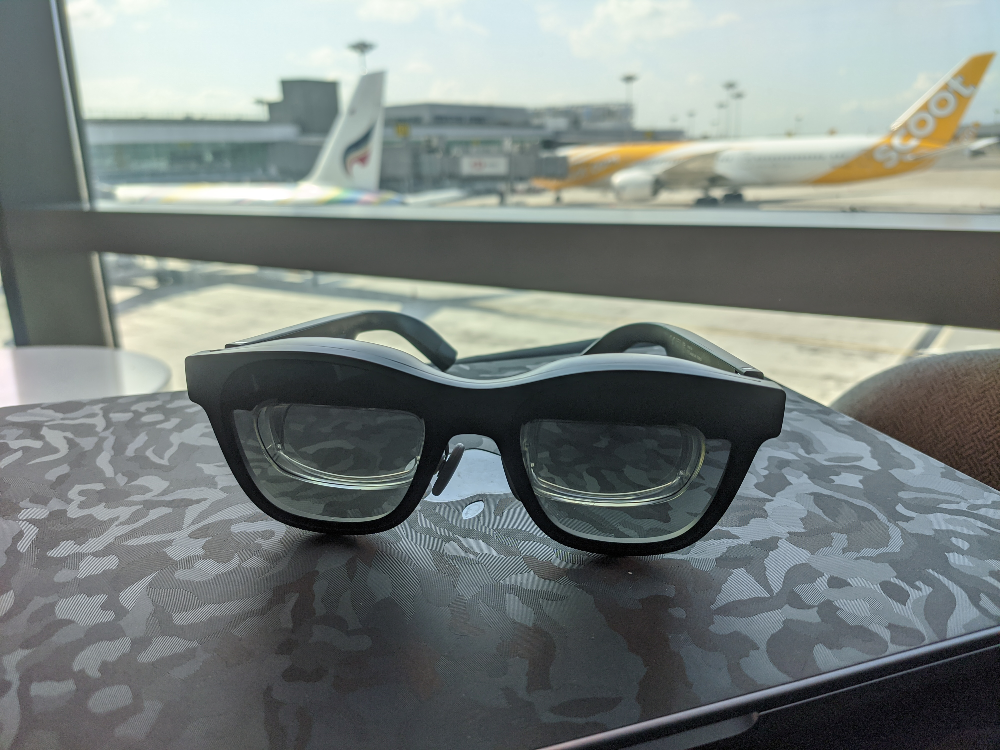
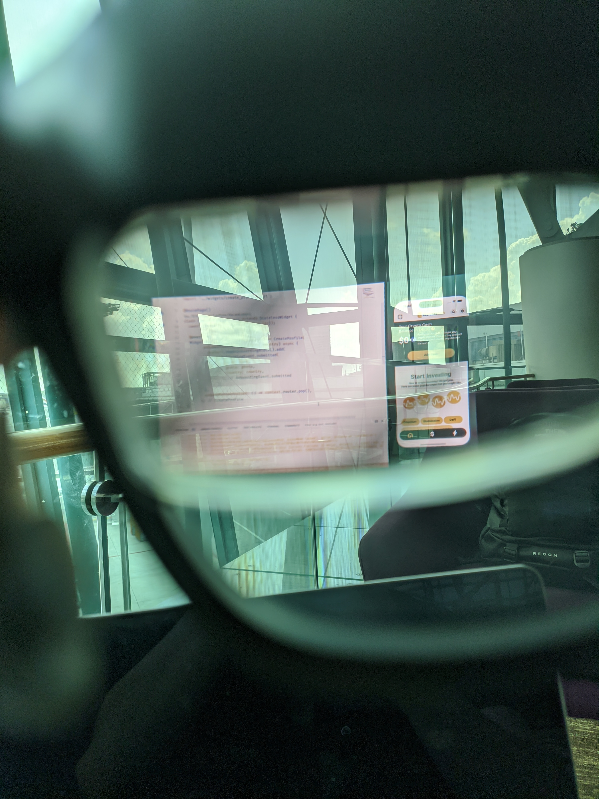

## AR Glasses: The Game-Changer for Software Development

Augmented reality (AR) glasses have gained significant popularity recently, offering a unique blend of technology and convenience. While most reviews focus on entertainment purposes like streaming movies or gaming, others wonder if AR glasses are suitable for boosting productivity in fields like coding and software development. In this blog, we'll explore the benefits and considerations of using AR glasses for software development and how they can revolutionize your workflow.

Over the past three months, I've had the opportunity to test the XReal Air glasses (formerly known as NReal) in conjunction with my trusty MacBook Pro. These glasses have become my constant companions, accompanying me everywhere I work—be it at home, bustling coffee shops, quiet public libraries, or even airports. The lightweight design and compact carry case make it effortless to carry them in my backpack alongside my everyday work gear.

<!--truncate-->

## Seamless Setup and Enhanced Functionality

Setting up the AR glasses is remarkably straightforward. Simply connect them to your laptop via USB-C, and your screen instantly mirrors onto the glasses. While in this mode, the display follows your head movements, allowing you to work freely without any restrictions. However, the real magic happens when you leverage the Nebula app provided by XReal. This app enables you to create a multi-monitor setup with support for up to three screens, complete with body anchor functionality and customizable screen distance, size, and angle. These features make the XReal Air glasses a perfect fit for coding and software development.

One of the most significant advantages of these glasses is the clarity and crispness of the triple monitor setup. As a software developer involved in mobile and web app creation, having multiple monitors is highly beneficial. Picture your favorite integrated development environment (IDE) at the center, a mobile simulator or Chrome debug instance on the right, and a browser window with ChatGPT and Slack on the left. All of these applications run seamlessly on the AR glasses' silky-smooth 72 Hz display, providing an immersive and productive working environment. Additionally, XReal plans to release a firmware update in the near future, upgrading the display to an impressive 90 Hz.

## Overcoming Limitations

Although AR glasses offer numerous advantages, they do have some limitations to consider. Bright light sources directly in your field of view can affect image clarity. However, XReal has included a glass cover to mitigate this issue, effectively eliminating any interference caused by external light sources. Another aspect to be aware of is the field of view (FOV), which may require slight head movements to view the entire screen area. While this adjustment may take some getting used to, the expanded screen real estate and productivity benefits make it a worthwhile trade-off.

## Are AR Glasses for You?

Now, let's address the question: should you replace your home multi-monitor setup with AR glasses? For most people, physical monitors would still be the better choice in a home office environment. However, if you're a frequent traveler or enjoy working in coffee shops, AR glasses are a game-changer. The crystal-clear image quality provided by these glasses, combined with the ability to expand your screen real estate anywhere you go, offers an unprecedented level of flexibility and mobility. If your work involves software development and you find yourself frequently on the move, I wholeheartedly recommend considering AR glasses like the XReal Air.

In conclusion, AR glasses have the potential to revolutionize the way software developers work by enhancing productivity and mobility. With their easy setup, multi-monitor capabilities, and immersive experience, these glasses offer a new dimension to software development. While they may not replace traditional monitors in a home office setup, their benefits truly shine when it comes to working on the go. Embrace the future of software development with AR glasses and unlock a world of possibilities.

If you have any other questions about AR glasses or need further information, feel free to contact me anytime. I'm here to help and provide additional insights into these innovative tools. Together, let's explore the exciting possibilities that AR glasses bring to the world of software development.